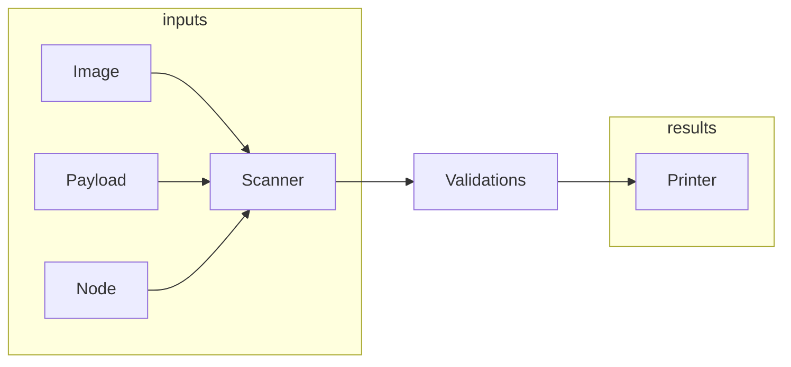

# check-payload


## About

This application scans container images in an OpenShift release payload, RHEL based nodes, or an operator image for FIPS enabled binaries. The goal is to ensure binaries are compiled correctly for OpenShift.

## Build

```sh
git clone https://github.com/openshift/check-payload.git
cd check-payload
make
```

## Run

### Prerequisites

* podman should be installed on the node.
* podman should be configured with pull secrets for the images to be scanned.

### Configuration

The binary has a number of built-in configuration files.

A default built-in configuration ([config.toml](./config.toml)) is used if no
options are specified, and no `./config.toml` file is available from the
current working directory when running the tool.

A specific configuration from a file can be specified using
`--config path/to/config.toml` option. Use `--config /dev/null` to use an empty
configuration.

An additional built-in coniguration tailored for a specific OpenShift version
can be specified using `-V`, `--config-for-version` option, for example `-V
4.11`. When this option is specified, the settings from the additional
configuration are added to (rather than override) the main configuration (see
above). These additional for-version configurations are embedded into the
binary during build time from the directories under
[dist/releases/](./dist/releases/).

### Scan an OpenShift release payload

```sh
 sudo ./check-payload scan payload -V 4.11 \
   --url quay.io/openshift-release-dev/ocp-release:4.11.44-x86_64 \
   --output-file report.txt
```

Here
* `-V` specifies the configuration for a particular OpenShift version;
* `--url` specifies a payload URL;
* `--output-file` specifies a file to write the scan report to.

### Scan a Local Unpacked Image Bundle

The `scan local` subcommand allows you to scan a local unpacked image bundle for FIPS compliance. This is particularly useful for testing or analyzing local images that have been unpacked using tools like `umoci`.

#### Usage

To scan a local unpacked image bundle, use the following command:

```sh
./check-payload scan local --path /path/to/local/bundle
```

Here:
* `--path` specifies the path to the local unpacked image bundle.

#### Example

```sh
./check-payload scan local --path ./test/resources/mock_unpacked_dir-1
```

This command will scan the local image bundle located in `./test/resources/mock_unpacked_dir-1`.

#### Use Case

This feature is useful for verifying FIPS compliance of container images in a local development environment,
without requiring access to `podman mount` which is blocked in some pipeline build systems.

### Scan a container or operator image

```sh
sudo ./check-payload scan operator \
  --spec registry.ci.openshift.org/ocp-priv/4.11-art-assembly-art6883-3-priv@sha256:138b1b9ae11b0d3b5faafacd1b469ec8c20a234b387ae33cf007441fa5c5d567
```

### Scan a node using container image

```sh
IMAGE=some.registry.location/check-payload
podman run --privileged -ti -v /:/myroot $IMAGE scan node --root /myroot
```

## How it works

`check-payload` gathers container images from OpenShift release payloads or
container images. The scanner can also be used on a RHEL or RHCOS node to scan the
root image. A node scan runs within a container with the host OS mounted within
it.

### Container Image and Payload Scans

Container Image and Payload Scans gather images and emit file paths to the
validation logic. This is done by `podman` mounting the image to the local
machine, walking the directory tree, and emitting the paths for executables to
the validation engine.

### Node Scans

RHEL or RHCOS nodes can be scanned with `check-payload scan node`. To gather the
file input paths the scanner queries for all the RPMs on the system and walks
the paths within the RPMs finding executables. The list of executable paths are
then processed by the validation engine.

### Diagram



### Validations

The validation engine uses different logic to validate golang and non-golang executables. The scanner only scans for ELF executables.

#### All

All scans validate the inclusion of OpenSSL via libcrypto found in `/usr/lib64`
or `/usr/lib`. The OpenSSL library is also validated to include `{FIPS_mode,
fips_mode, or EVP_default_properties_is_fips_enabled}`.

#### Regular Executables

The rules to scan regular executables are:

1. Must be dynamically linked

Most of RHEL/RHCOS executables are built dynamically to allow for dynamic
linking to OpenSSL. There are exceptions for rule (1) which consists of some
binaries (ldconfig, build-locale-archive, etc) which are required to be built
statically, and/or do not provide cryptographic functionality.

#### Golang Executables

Golang validations run through a pipeline:

1. validateGoVersion - enumerates the golang version and compile details
1. validateGoCgo - ensure CGO_ENABLED=1 is set
1. validateGoCGOInit - ensure cgo_init is within the binary
1. validateGoStatic - ensure binary is dynamically linked
1. validateGoOpenssl - ensure openssl matches the dynamic library within the system
1. validateGoTags - ensure golang tags are set

#### Java Development Kit

JDK validations run through a pipeline:

1. validateFipsHost - ensures the `check-payload` tool is being run on a FIPS enabled host
1. validateSystemProperties - ensures pertinent [FIPS property values](https://access.redhat.com/documentation/en-us/openjdk/8/html/configuring_openjdk_8_on_rhel_with_fips/config-fips-in-openjdk) are not being set at runtime
1. validateAlgorithms - ensures unacceptable algorithms and protocols are disabled at runtime

#### Rust Executables

Rust executables are detected by their cargo-auditable section or the `rustc` producer string. The check proves positive module evidence rather than the absence of suspicious crypto: it names the crypto provider each binary bundles and requires that provider to be an attested FIPS-certified module. A binary that links the system OpenSSL FIPS provider (recorded as the `openssl` module, like the Go and regular-executable arms) is the compliant case.

A bundled provider is detected from two sources:

1. A symbol scan for a bundled crypto backend (ring, a vendored or static OpenSSL, BoringSSL, or aws-lc). Backends are detected by their defined symbols, not by crate name. Undefined imports of the same names resolve to the system libcrypto and are the compliant case, so they are not flagged.
1. The cargo-auditable manifest, matched against the `rust_denied_crypto` list for crates that bundle crypto, including the pure-Rust primitives that leave no symbol. The manifest is authoritative when present; a symbol backend is added only when the manifest names no crate of the same provider family, so a precise `aws-lc-fips-sys` is not shadowed by a coarse `aws-lc`.

Each detected provider is recorded as a module candidate and validated through the same `fips_certified_modules` path used for the OpenSSL and Go modules. A provider with a matching certified-module entry passes. When that entry points to a separate artifact, the certified-module phase checks the artifact is present at a certified version. A statically bundled provider is attested by module name, as the tool treats other binary-source modules, so its crate version is not yet range-checked. A provider with no matching entry fails inline, so scan paths that do not run the certified-module phase (for example the node RPM scan) still refuse bundled crypto. A binary with no detected provider and no cargo-auditable manifest is inconclusive and reported as a warning. A manifest that is present but unparseable is treated as corrupt audit evidence and fails, rather than being downgraded to the absent-manifest warning.

The `rust_denied_crypto` list names the crates treated as bundled crypto. It is a best-effort, non-exhaustive supplement to the structural symbol scan, and is extended in config rather than in code. It selects what to treat as a provider candidate; it is not the pass/fail authority, which is the certified-module attestation. The shipped list is a floor: an explicit `--config` unions with it rather than replacing it, so a config that omits the list cannot disable candidate detection.

The symbol scan reads the ELF symbol table and the manifest reads the `.dep-v0` section. Red Hat RPM builds run `eu-strip`, which by default removes both `.symtab` and `.dep-v0`, so a released binary can lose both signals and fall to the inconclusive warning. Positive module evidence is therefore contingent: it gates a released binary only when the manifest survives stripping and the scan runs with `--fail-on-warnings`. That warning does not fail the run on its own. To gate released Rust binaries, preserve the manifest through stripping (`eu-strip --keep-section=.dep-v0`, or mark `.dep-v0` `SHF_ALLOC`) or scan before the strip step, and run with `--fail-on-warnings`. If both `.dep-v0` and the `rustc` producer string in `.comment` are stripped, the binary is no longer recognized as Rust and is scanned as a regular executable. A dynamically linked binary that bundles its own crypto then passes silently, so preserving the manifest matters for detection as well as gating.

A statically linked, CMVP-validated module such as `aws-lc-fips-sys` fails until an operator adds a matching `fips_certified_modules` entry for it, because the tool ships no unverified module claims. Adding that entry is the supported way to accept a validated static module; it reuses the certified-module path rather than an ignore-list exception.

### Printer

The printer aggregates all the results and formats into a table, csv, markdown, etc. If any errors are found then the process exits non-zero. A successful run returns 0.
